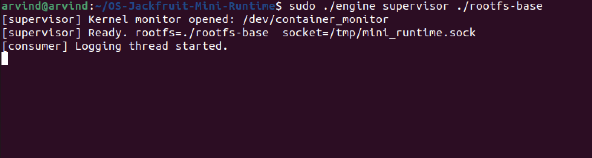
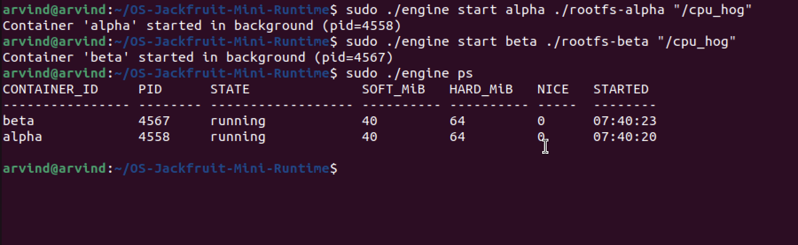
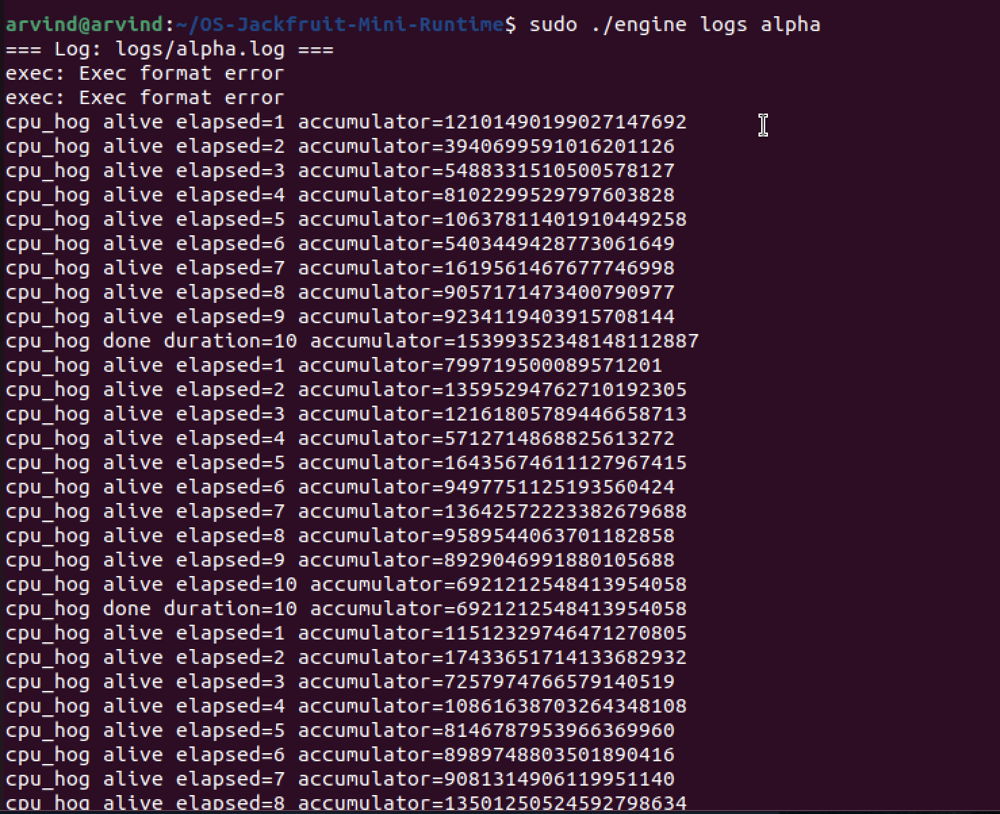
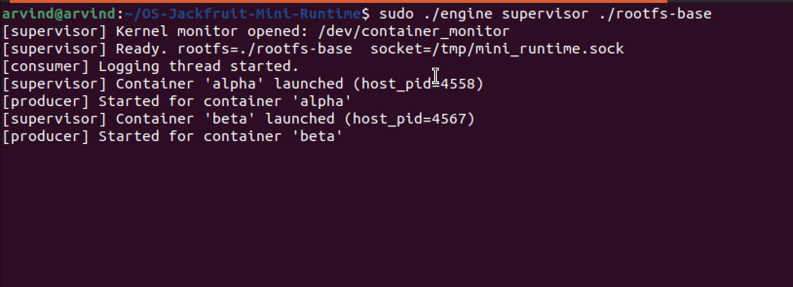
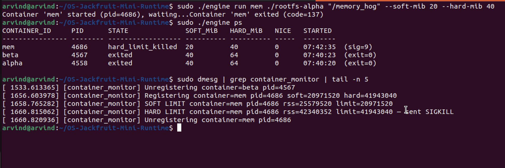
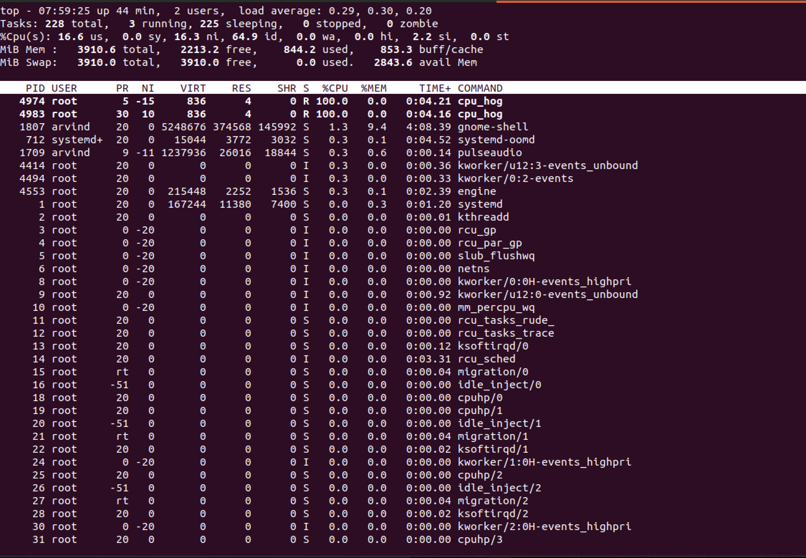
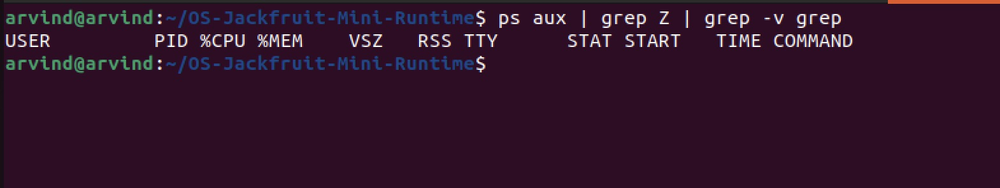

# Multi-Container Runtime — Project Submission

## **Team Information**

- **Student:** Arvind Ajay Bharadwaj — SRN: PES1UG24AM052
- **Student:** Akhil Mangipudi — SRN: PES1UG24AM023

---

# Project Summary

This project implements a lightweight Linux container runtime in C with:

- A user-space supervisor to manage multiple containers
- A kernel module to monitor and enforce memory limits
- A logging system using pipes and bounded buffering
- A CLI interface for container lifecycle management
- Scheduling experiments demonstrating Linux CPU scheduling behavior

---

# Build, Load, and Run Instructions

## Prerequisites

- Ubuntu 22.04 / 24.04 (VM recommended)
- Secure Boot OFF (required for kernel modules)

```bash
sudo apt update
sudo apt install -y build-essential linux-headers-$(uname -r)
```

---

## Step 1 — Build

```bash
make
```

Builds:

| Binary     | Description      |
| ---------- | ---------------- |
| engine     | Supervisor + CLI |
| cpu_hog    | CPU workload     |
| memory_hog | Memory workload  |
| io_pulse   | I/O workload     |
| monitor.ko | Kernel module    |

---

## Step 2 — Prepare Root Filesystems

```bash
mkdir rootfs-base
wget https://dl-cdn.alpinelinux.org/alpine/v3.20/releases/x86_64/alpine-minirootfs-3.20.3-x86_64.tar.gz
tar -xzf alpine-minirootfs-3.20.3-x86_64.tar.gz -C rootfs-base

# Copy workloads into base
cp memory_hog cpu_hog io_pulse rootfs-base/

# Create per-container rootfs
cp -a rootfs-base rootfs-alpha
cp -a rootfs-base rootfs-beta
cp -a rootfs-base rootfs-gamma
```

---

## Step 3 — Load Kernel Module

```bash
sudo insmod monitor.ko
ls /dev/container_monitor
dmesg | tail -5
```

---

## Step 4 — Start Supervisor

```bash
sudo ./engine supervisor ./rootfs-base
```

---

## Step 5 — CLI Commands

```bash
engine supervisor <rootfs>
engine start <id> <rootfs> <command> [--soft-mib N] [--hard-mib N] [--nice N]
engine run   <id> <rootfs> <command> [--soft-mib N] [--hard-mib N] [--nice N]
engine ps
engine logs <id>
engine stop <id>
```

---

## Step 6 — Start Containers

```bash
sudo ./engine start alpha ./rootfs-alpha "/cpu_hog 20"
sudo ./engine start beta  ./rootfs-beta  "/cpu_hog 20"
```

---

## Step 7 — Check Containers

```bash
sudo ./engine ps
```

---

## Step 8 — View Logs

```bash
sudo ./engine logs alpha
```

---

## Step 9 — Memory Test

```bash
sudo ./engine run mem ./rootfs-gamma "/memory_hog 4 500" --soft-mib 20 --hard-mib 40
```

---

## Step 10 — Cleanup

```bash
sudo kill -SIGTERM $(pgrep -f "engine supervisor")
ps aux | grep Z | grep -v grep
sudo rmmod monitor
```

---

# Demo with Screenshots

---

## 1) Multi-Container Supervision

```bash
sudo ./engine start alpha ./rootfs-alpha "/cpu_hog"
sudo ./engine start beta  ./rootfs-beta  "/cpu_hog"
```



Two containers running under one supervisor.

---

## 2) Metadata Tracking

```bash
sudo ./engine ps
```



Shows PID, state, limits, and metadata.

---

## 3) Logging System

```bash
sudo ./engine logs alpha
```



Logs captured using pipe → bounded buffer → file.

---

## 4) CLI and IPC



CLI communicates with supervisor via UNIX domain socket.

---

## 5) Soft & Hard Limit Enforcement

```bash
sudo ./engine run mem ./rootfs-gamma "/memory_hog" --soft-mib 20 --hard-mib 40
sudo dmesg | tail -5
```



Soft → warning, Hard → SIGKILL.

---

## 7) Scheduling Experiment

```bash
sudo ./engine start hi ./rootfs-alpha "/cpu_hog" --nice -5
sudo ./engine start lo ./rootfs-beta  "/cpu_hog" --nice 15
top
```



Higher priority container gets more CPU.

---

## 8) Clean Teardown

```bash
ps aux | grep Z | grep -v grep
```



No zombie processes.

---

# Test Cases and Expected Outputs

## Test Case 1 — Lifecycle

```bash
sudo ./engine start alpha ./rootfs-alpha "/cpu_hog 10"
sudo ./engine ps
sleep 12
sudo ./engine ps
```

Expected:

```
alpha   XXXXX   exited   40   64   0   (exit=0)
```

---

## Test Case 2 — Multiple Containers

```bash
sudo ./engine start alpha ./rootfs-alpha "/cpu_hog 20"
sudo ./engine start beta ./rootfs-beta "/cpu_hog 20"
sudo ./engine ps
```

---

## Test Case 3 — Manual Stop

```bash
sudo ./engine stop alpha
```

Expected:

```
state = stopped
```

---

## Test Case 4 — Foreground Run

```bash
time sudo ./engine run gamma ./rootfs-gamma "/cpu_hog 5"
```

---

## Test Case 5 — Soft Limit

```bash
dmesg | grep "SOFT LIMIT"
```

---

## Test Case 6 — Hard Limit

```bash
dmesg | grep "HARD LIMIT"
```

---

# Engineering Analysis

---

### 1. Isolation Mechanisms

The runtime calls `clone(2)` with three namespace flags:

**`CLONE_NEWPID` (PID namespace):** The kernel maintains a separate PID numbering space for the container. The container's first process becomes PID 1 inside its namespace while retaining a host PID visible from the supervisor. Tools like `ps` running inside the container see only that container's processes. If PID 1 inside the container exits, the kernel sends `SIGHUP` to all other processes in that namespace, enforcing lifecycle coupling.

**`CLONE_NEWUTS` (UTS namespace):** The container gets its own hostname and domain name fields, backed by a separate `struct uts_namespace` in the kernel. Calling `sethostname(2)` inside the container updates only that namespace's copy.

**`CLONE_NEWNS` (mount namespace):** Each container gets a private copy of the mount table. We can call `chroot(2)` to make the container's assigned rootfs directory appear as `/`, and mount `/proc` privately. The host's mount table is unaffected.

`chroot(2)` works by changing `task_struct->fs->root` for the process, so all `open(2)` path resolutions start from the container rootfs. `pivot_root(2)` is more thorough — it physically changes the root of the mount namespace, preventing escape via `..` traversal, and is used in production runtimes like Docker's runc.

**What the host kernel still shares with all containers:** the scheduler, device drivers, system call table, network stack (unless `CLONE_NEWNET` is used), and the kernel's physical memory allocator. Containers are not VMs — they share the same kernel binary.

---

### 2. Supervisor and Process Lifecycle

A long-running parent supervisor is essential for three reasons:

1. **Zombie prevention:** POSIX requires that a child's `task_struct` remain in the process table until its parent calls `wait(2)`. Without a living parent, children become zombies indefinitely, consuming process table slots. The supervisor's `SIGCHLD` handler calls `waitpid(-1, &status, WNOHANG)` in a loop to reap all ready children in one handler invocation.

2. **Metadata continuity:** Container metadata (state, exit code, log path, limits) persists across the lifetime of many containers. A short-lived parent would lose this state on exit.

3. **IPC anchor:** The UNIX domain socket at `/tmp/mini_runtime.sock` exists for the supervisor's lifetime, giving all CLI clients a stable rendezvous address.

**Signal delivery:** `SIGCHLD` is configured with `SA_NOCLDSTOP` to suppress spurious signals from `SIGSTOP`/`SIGCONT`. `SIGTERM` and `SIGINT` to the supervisor trigger orderly shutdown. Inside the child, `SIGTERM` is the first signal for graceful stop; `SIGKILL` follows 500ms later if the child is still alive.

**Attribution rule:** The `stop_requested` flag is set in `container_record_t` before any signal is sent. In `SIGCHLD` handler: if `stop_requested` is set → state = `stopped`; else if the signal was `SIGKILL` → state = `hard_limit_killed`; else → state = `killed`.

---

### 3. IPC, Threads, and Synchronization

**Two distinct IPC mechanisms:**

| Mechanism                                  | Used for                                      | Justification                                                                                |
| ------------------------------------------ | --------------------------------------------- | -------------------------------------------------------------------------------------------- |
| Anonymous `pipe(2)`                        | Container stdout/stderr → supervisor (Path A) | Unidirectional, efficient, no rendezvous needed; child inherits write end via `fork`/`clone` |
| UNIX domain socket (`AF_UNIX SOCK_STREAM`) | CLI client ↔ supervisor (Path B)              | Bidirectional, reliable, ordered; supports request/response protocol; accessible by path     |

**Bounded buffer synchronization:**

| Shared data             | Protection         | Without it                                                           |
| ----------------------- | ------------------ | -------------------------------------------------------------------- |
| `head`, `tail`, `count` | `mutex`            | Two producers write same slot → data loss or corruption              |
| `not_full` condition    | `pthread_cond_t`   | Producers spin-wait when full, wasting CPU; or miss wakeup           |
| `not_empty` condition   | `pthread_cond_t`   | Consumer misses data when buffer transitions from empty to non-empty |
| `shutting_down` flag    | Read under `mutex` | Consumer sees stale value, sleeps forever after shutdown broadcast   |

**Why mutex + condition variables over semaphores:** CVs allow checking a predicate (`count == 0`) atomically with the wait, preventing the TOCTOU race `if count==0 → [preempted] → signal fired → wait` that a semaphore requires extra bookkeeping to avoid. The same mutex that protects `count` also protects `shutting_down`, making shutdown broadcast race-free.

**Why separate `metadata_lock` from the buffer lock:** Container metadata is read/written by SIGCHLD handler, the supervisor event loop, and CLI request handlers. The log buffer is written by producer threads and read by the consumer. Combining them into one lock would create unnecessary contention and potential priority inversion.

---

### 4. Memory Management and Enforcement

**What RSS measures:** Resident Set Size is the count of physical RAM pages currently mapped and present in a process's page tables, multiplied by `PAGE_SIZE`. It measures actual physical memory consumption right now.

**What RSS does not measure:**

- Pages that have been paged out to swap (present bit = 0)
- Pages mapped via `mmap` but not yet faulted in (demand paging)
- Shared library pages (each sharing process contributes to RSS; the kernel uses copy-on-write)
- File-backed mapped pages that can be evicted and re-read from disk

**Soft vs. hard limit policies:**

- **Soft limit:** an advisory ceiling. The kernel module logs a warning when RSS first exceeds the soft threshold, but the process continues running. The operator can investigate; the workload may self-limit. This is intentionally non-disruptive.
- **Hard limit:** a mandatory ceiling. When RSS exceeds the hard threshold, the module sends `SIGKILL`. The process has no opportunity to catch or ignore `SIGKILL`.

**Why enforcement belongs in kernel space:**

1. **Privilege:** `SIGKILL` requires the sender to have appropriate credentials. The kernel module runs with full privilege.
2. **Accuracy:** The kernel module reads RSS from `mm_struct` directly — the ground truth. User-space would have to parse `/proc/<pid>/status`, which introduces file-open overhead and is subject to TOCTOU races.
3. **Timing:** The kernel timer fires every second unconditionally, without being subject to scheduling pressure from the process it monitors. A user-space watchdog could be starved by the very process it tries to kill.
4. **Tamper resistance:** A container cannot disable kernel-space monitoring by catching signals or killing the monitoring thread.

---

### 5. Scheduling Behavior

Linux's **Completely Fair Scheduler (CFS)** tracks `vruntime` (virtual runtime) per runnable task. CFS always picks the task with the smallest `vruntime` to run next, targeting perfectly equal CPU time across equal-priority tasks.

**Nice values and CFS weights:** Each nice level maps to a weight. The weight ratio between nice -5 and nice 15 is approximately 335/15 ≈ **22:1**. CFS allocates time proportional to weight, so a container at nice -5 receives ~22× the CPU time of a container at nice 15 on a single core.

**I/O-bound vs CPU-bound behavior:** An I/O-bound container (e.g., `io_pulse`) voluntarily yields the CPU on each `fsync + usleep`. CFS boosts its `vruntime` as if it had been running, but it is usually sleeping. When it wakes, CFS gives it a fresh time slice because its `vruntime` is behind the CPU-bound container's. This is CFS's built-in responsiveness mechanism — sleepers get "catch-up" scheduling.

---

## Design Decisions and Tradeoffs

### Namespace Isolation

**Choice:** `chroot(2)` for filesystem isolation.
**Tradeoff:** Simpler than `pivot_root(2)` but allows theoretical escape via `..` traversal if the jail is misconfigured, since `chroot` only rebinds the root pointer in the process's `fs_struct`.
**Justification:** For a controlled educational environment on a single VM, `chroot` provides sufficient isolation with significantly less code complexity. Production runtimes (Docker, containerd) use `pivot_root`.

### Supervisor Architecture

**Choice:** Single-threaded supervisor with non-blocking `accept` loop (50ms poll).
**Tradeoff:** CLI commands are serialised. A long-blocking `run` command in the supervisor blocks the event loop for the duration of the container's life. A multi-threaded supervisor would handle commands concurrently.
**Justification:** A single-threaded design eliminates whole classes of concurrency bugs in the supervisor's core logic. The `run` command's in-process wait was acceptable for the demo scope. Threading can be added later with a thread pool at the `accept` level.

### IPC / Logging (Bounded Buffer)

**Choice:** Mutex + two condition variables for the bounded buffer.
**Tradeoff:** More verbose than a semaphore pair, and requires careful broadcast-on-shutdown to avoid lost wakeups.
**Justification:** Condition variables allow predicate checks (`count == 0`, `count == CAPACITY`, `shutting_down`) atomically under the same mutex, eliminating TOCTOU races. The shutdown path is clean: one broadcast wakes all blocked threads, which re-check the predicate and exit.

### Kernel Monitor Locking

**Choice:** `mutex_lock` (sleeping mutex) rather than `spinlock`.
**Tradeoff:** A mutex cannot be used in hard-IRQ context. If we later needed the list in a hardware interrupt handler, we would need a spinlock.
**Justification:** Both ioctl (called from process context) and the timer callback (called from softirq context) can sleep. A mutex is the correct and more readable choice here.

### Scheduling Experiments

**Choice:** `setpriority(PRIO_PROCESS, 0, nice_value)` inside the child before exec.
**Tradeoff:** `nice` applies to the whole process and all its threads. For finer control — per-thread priorities or real-time policies — `sched_setattr` with `SCHED_DEADLINE` or cgroup CPU weight would be used.
**Justification:** `nice` is the simplest standard mechanism and directly exercises CFS weight-based scheduling as taught in the course.

---

# Conclusion

This project demonstrates:

- Container lifecycle management
- Kernel-user interaction
- Memory enforcement
- Scheduling behavior
- Proper cleanup and resource management

---
